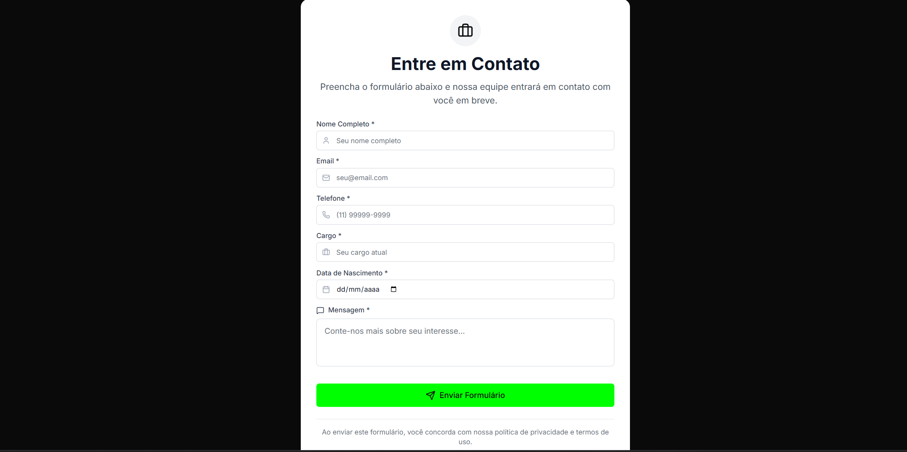
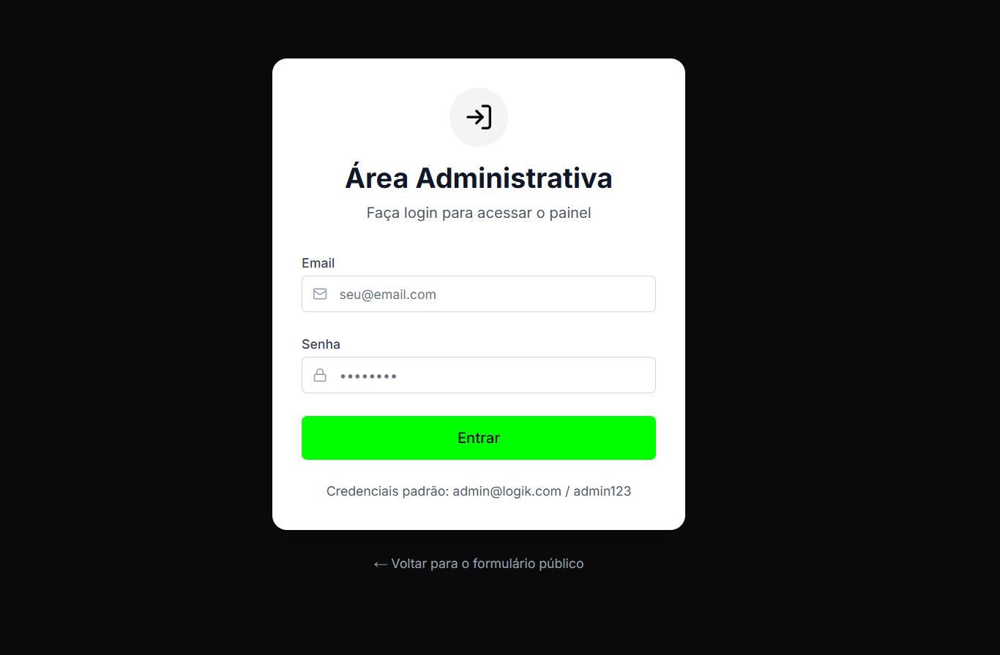
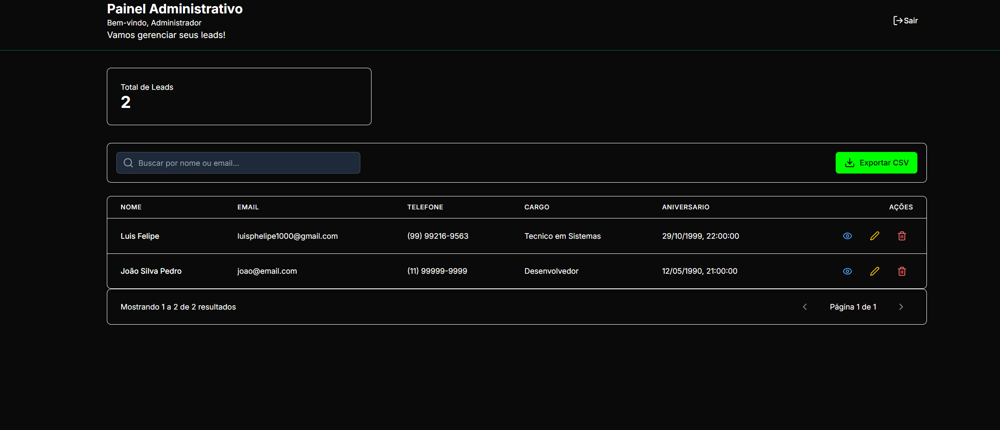
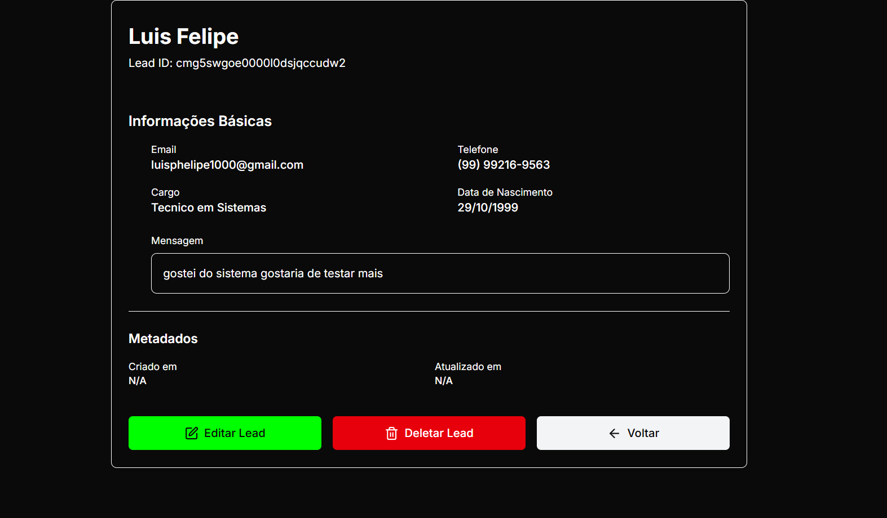
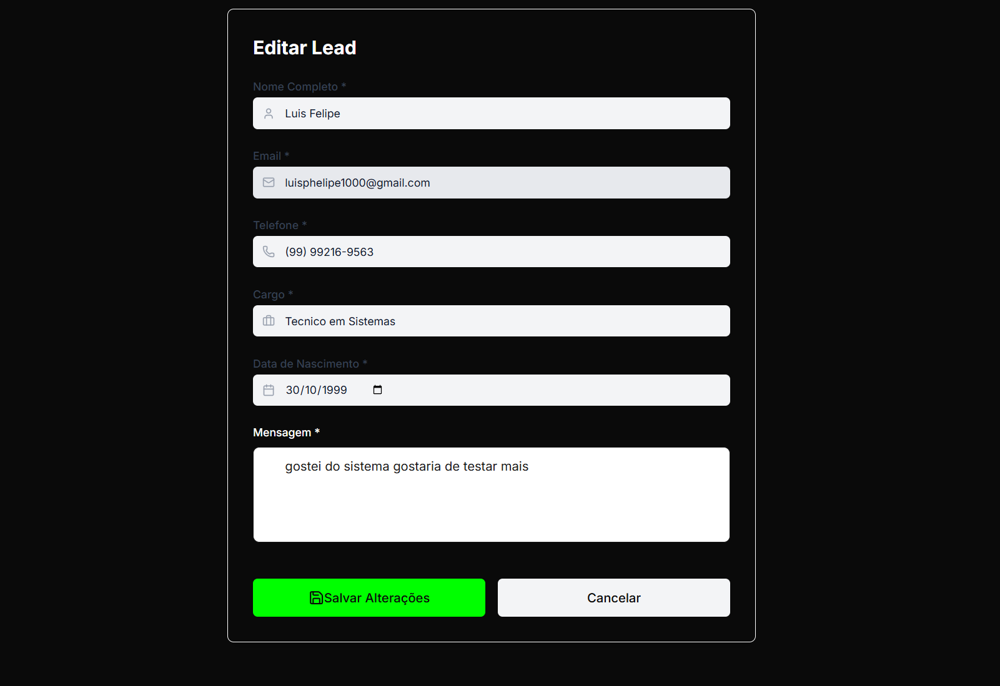

# 🚀 Lead Management System - L0gik

## 📸 Screenshots da Aplicação

### 🌐 Formulário Público


_Formulário responsivo para captação de leads com validações e tracking automático_

### 🏠 Área Administrativa - Login


_Tela de login segura para acesso ao painel administrativo_

### 📊 Painel Administrativo


_Dashboard completo com listagem, busca, estatísticas e ações de CRUD_

### 👁️ Visualização Única do Lead


_Página detalhada do lead com todas as informações e dados de tracking_

### ✏️ Editar Lead


_Interface para edição de leads com validações e formatação automática_

## 🎯 Sobre a Aplicação

O **Lead Management System** é uma solução completa para captação e gestão de leads empresariais. Desenvolvido como parte de um teste técnico para Desenvolvedor Full Stack, o sistema demonstra habilidades avançadas em desenvolvimento frontend moderno.

### 🏗️ Arquitetura Técnica

- **Framework:** Next.js 15.5.4 com App Router
- **Linguagem:** TypeScript 5
- **Estilização:** Tailwind CSS v4 com tema customizado
- **Formulários:** React Hook Form + Zod para validação
- **Estado:** Context API + Hooks customizados
- **Notificações:** React Hot Toast
- **Ícones:** Lucide React
- **Build:** Turbopack para desenvolvimento rápido

## ⚡ Funcionalidades Principais

### 🌐 **Formulário Público**

- ✅ Campos obrigatórios: nome, email, telefone, cargo, data nascimento, mensagem
- ✅ Validações em tempo real (email válido, telefone brasileiro)
- ✅ Formatação automática de telefone: `(11) 99999-9999`
- ✅ Tracking automático de UTMs (utm_source, utm_medium, utm_campaign, etc.)
- ✅ Captura automática de GCLID e FBCLID
- ✅ Design responsivo com tema verde/preto

### 🔐 **Sistema de Autenticação**

- ✅ Login local seguro (admin@logik.com / admin123)
- ✅ Proteção de rotas administrativas
- ✅ Context de autenticação global
- ✅ Redirecionamento automático

### 📊 **Painel Administrativo**

- ✅ **Dashboard:** Estatísticas em tempo real
- ✅ **Listagem:** Paginação, busca por nome/email
- ✅ **Visualização:** Página individual do lead com dados completos
- ✅ **Edição:** Formulário de edição com validações
- ✅ **Exclusão:** Remoção segura com confirmação
- ✅ **Exportação:** Download em formato CSV
- ✅ **Tracking:** Visualização de dados UTM/GCLID/FBCLID

### 🎨 **Design e UX**

- ✅ **Tema Customizado:** Verde neon (#00FF00) + Preto (#0A0A0A)
- ✅ **Responsivo:** Mobile-first design
- ✅ **Componentes Modulares:** Button, Input, LoadingSpinner, ErrorState
- ✅ **Microinterações:** Loading states, hover effects, transitions
- ✅ **Acessibilidade:** Labels, ARIA attributes, keyboard navigation

## 🛠️ Como Rodar a Aplicação

### 📋 **Pré-requisitos**

- Node.js 18+
- npm, yarn ou pnpm

### 🚀 **Instalação e Execução**

```bash
# 1. Clone o repositório
git clone https://github.com/PhelipeG/logik-manager-lead-web.git

# 2. Entre na pasta do frontend
cd logik-manager-lead-web

# 3. Instale as dependências
npm install

# 4. Execute em modo desenvolvimento
npm run dev

# 5. Acesse a aplicação
# 🌐 Formulário Público: http://localhost:3000
# 🔐 Área Admin: http://localhost:3000/admin/login
```

### 🔑 **Credenciais de Acesso**

```
Email: admin@logik.com
Senha: admin123
```

### 📦 **Scripts Disponíveis**

```bash
# Desenvolvimento
npm run dev          # Servidor de desenvolvimento (Turbopack)

# Build
npm run build        # Build para produção
npm run start        # Executar build de produção

# Qualidade de Código
npm run lint         # Verificar ESLint
npm run lint:fix     # Corrigir problemas do ESLint
npm run prettier     # Verificar formatação
npm run prettier:fix # Corrigir formatação
npm run format       # Prettier + ESLint juntos
npm run type-check   # Verificar tipos TypeScript
```

### 🌍 **Variáveis de Ambiente (Opcional)**

```bash
# .env.local
NEXT_PUBLIC_API_URL=http://localhost:5000
NEXT_PUBLIC_GTM_ID=GTM-XXXXXXX
NEXT_PUBLIC_GA4_ID=G-XXXXXXXXXX
```

## 🏆 **Destaques Técnicos**

### 🧩 **Arquitetura Modular**

- **Hooks Customizados:** `useLeads`, `useSingleLead`
- **Componentes Reutilizáveis:** UI library própria
- **Context Pattern:** Gerenciamento de estado global
- **Barrel Exports:** Imports organizados

### 🎯 **Tracking Profissional**

- **Enhanced Conversions** com dados reais do usuário
- **Cross-platform tracking** (GA4 + Meta + Google Ads)
- **Dados enriquecidos** únicos para melhor análise
- **UTM automation** completa

> **📝 Observação:** Embora eu não tenha conhecimento aprofundado em tracking e web analytics, tentei implementar as melhores práticas de tracking neste projeto como parte do aprendizado e demonstração técnica. A implementação inclui integração com Google Tag Manager, captura de UTMs, e eventos para GA4, Meta Pixel e Google Ads.

## 🎨 **Tema e Design**

### 🎨 **Paleta de Cores**

```css
--primary: #00ff00 /* Verde neon */ --secondary: #092309 /* Verde escuro */
  --background: #0a0a0a /* Preto */ --light: #ffffff /* Branco */;
```

## 🤝 **Contribuição**

Este projeto foi desenvolvido como parte de um teste técnico para demonstrar habilidades em:

- ✅ Desenvolvimento Frontend Moderno
- ✅ TypeScript e Next.js Avançado
- ✅ Arquitetura de Componentes
- ✅ Tracking e Analytics
- ✅ UX/UI Design
- ✅ Boas Práticas de Código

---

**Desenvolvido com ❤️ por [PhelipeG](https://github.com/PhelipeG) para L0gik**

**🏆 Stack:** Next.js 15 + TypeScript + Tailwind CSS + React Hook Form + Zod + GTM
